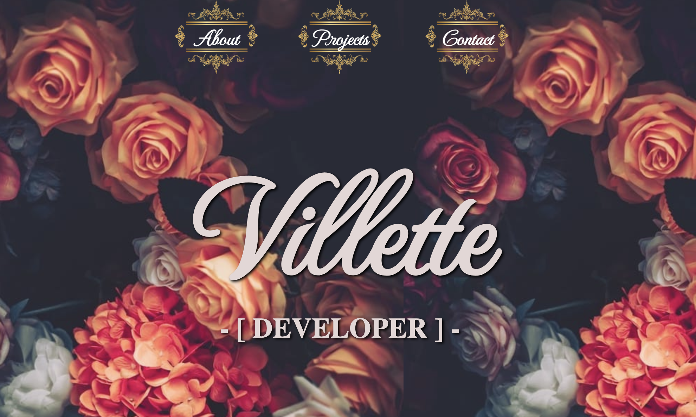

# Villlette Portfolio

## Website Description
This website contains 4 webpages, the index landing page, about, contact, and projects page which displays a grid of my projects that are linked to their deployed webpages.

## Tasks Completed
The HTML document includes:
* a proper title and SEO metadata
* SEO optimization
* semantic labelling

The CSS document includes:
* universal variables
* features such as drop shadows, opacity, background images
* Google font usage

## Languages
- HTML
- CSS

## Links
* [Deployed webpage](https://villette0.github.io/Practice-Multipage_Website)

* [Repository](https://github.com/villette0/Practice-Multipage_Website)

## Screenshot

